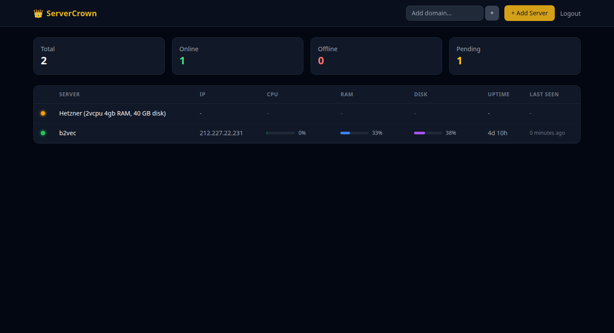
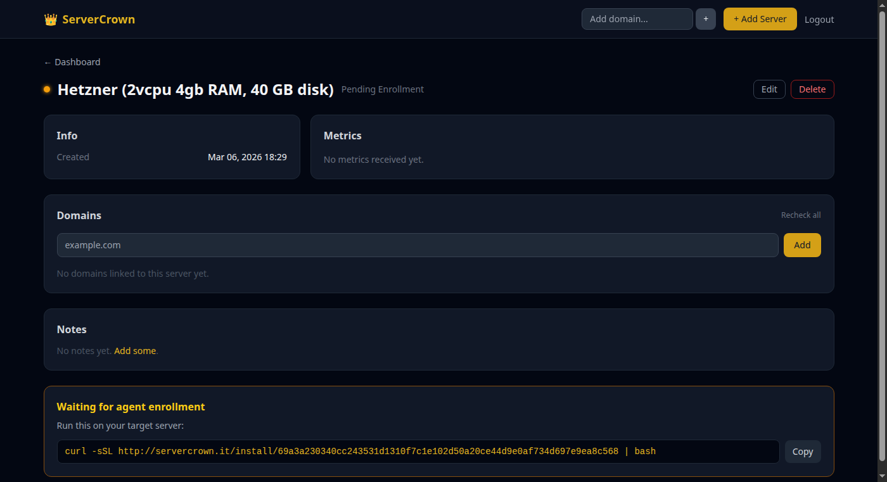
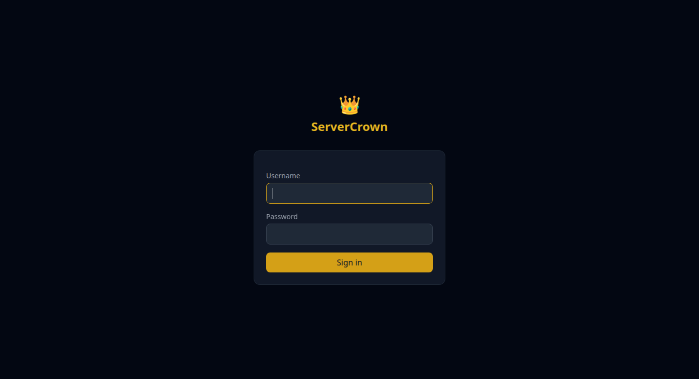

# server👑crown

A self-hosted control plane for managing all your servers from a single dashboard.

Install a lightweight agent on each server with a single command — real-time metrics, domain tracking, and server management from one place.

**Live demo:** [servercrown.it](https://servercrown.it)

## Screenshots

### Dashboard


### Server Detail


### Login


## How It Works

```
  ┌─────────────────── ServerCrown (Crown) ───────────────────┐
  │                                                           │
  │   Web UI (htmx) ──► Django Backend ──► WebSocket Server   │
  │                                                           │
  └──────────────────────────┬────────────────────────────────┘
                             │
              ┌──────────────┼──────────────┐
              │              │              │
        ┌─────┴─────┐ ┌─────┴─────┐ ┌─────┴─────┐
        │  Agent A  │ │  Agent B  │ │  Agent C  │
        │ (server1) │ │ (server2) │ │ (server3) │
        └───────────┘ └───────────┘ └───────────┘
```

The **agent** runs on each target server — it collects system metrics and sends them to the crown via WebSocket. The **crown** is a web app where you see all your servers and their health.

Agents connect **outbound** to the crown — no inbound ports needed on your servers.

## Quick Start

### 1. Deploy the Crown

```bash
git clone https://github.com/edoardoted99/servercrown.git
cd servercrown
docker compose up -d
```

Create a superuser:
```bash
docker compose exec crown python manage.py createsuperuser
```

### 2. Add a Server

Open the dashboard, click **+ Add Server**, and copy the install command:

```bash
curl -sSL https://your-crown/install/<token> | bash
```

The agent installs itself as a systemd service, connects to the crown, and your server appears on the dashboard with live metrics.

## Features

- **Real-time dashboard** — live CPU, RAM, disk metrics with progress bars
- **Agent enrollment** — one-command install on any Linux server
- **Domain tracking** — add a domain, DNS resolves and auto-matches to the right server
- **Server management** — edit name, tags, notes per server
- **WebSocket-based** — agents maintain a persistent connection, instant updates
- **HTMX frontend** — lightweight, reactive UI with no JS framework
- **Self-hosted** — your data stays on your infrastructure

## Architecture

| Component | Tech | Role |
|-----------|------|------|
| Agent | Python (psutil + websockets) | Metrics collection, heartbeat |
| Crown Backend | Django + Daphne + Channels | WebSocket server, views, agent management |
| Crown Frontend | htmx + Tailwind CSS | Reactive server-rendered UI |
| Database | SQLite | Server registry, metrics, domains |

## Project Structure

```
servercrown/
├── crown/                  # Django project
│   ├── crown/              # Django settings, urls, asgi
│   ├── servers/            # Main app (models, views, consumers)
│   └── templates/          # HTML templates
├── agent/                  # Agent script
│   └── agent.py            # Standalone agent
├── docker/                 # Dockerfiles
└── docker-compose.yml      # Dev environment
```

## Roadmap

- [x] Agent: heartbeat + metrics + WebSocket connection
- [x] Crown: server registry + enrollment + dashboard
- [x] One-command agent install script
- [x] Domain tracking with DNS auto-resolution
- [x] Docker dev environment
- [x] Production deployment with SSL
- [ ] Web terminal
- [ ] Multi-server command execution
- [ ] Alert engine + notifications
- [ ] Agent auto-update
- [ ] Multi-user support

## License

MIT
